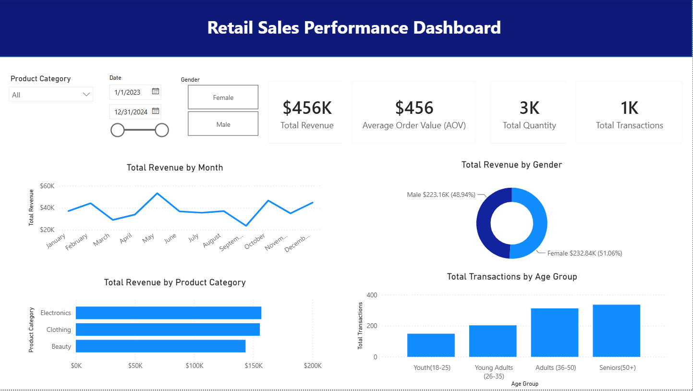

# 📊 Retail Sales Performance & Customer Analytics

## 🎯 1. The Problem & Business Question
Retail businesses often struggle to identify revenue drivers, track temporal sales fluctuations, and understand customer purchasing behaviors across demographic segments[cite: 9, 10]. 

**Key Business Questions Addressed:**
- What are the primary revenue drivers and top-performing product categories[cite: 9]?
- How does sales performance fluctuate on a monthly basis[cite: 9]?
- Who is our core customer persona (age distribution, gender breakdown)[cite: 9]?
- How can store managers optimize marketing campaigns and inventory based on purchasing patterns[cite: 9]?

---

## 📂 2. Dataset Explanation & Inputs
The analysis utilizes a structured retail dataset containing transactional and demographic data[cite: 9, 10].

* **Data Source & Scope:** Historical transactional records covering multi-category retail sales[cite: 9, 10].
* **Key Variables:** `Transaction ID`, `Date`, `Customer ID`, `Gender`, `Age`, `Product Category`, `Quantity`, `Price per Unit`, `Total Amount`[cite: 9].
* **Data Integrity:** Cleansed and validated tabular dataset with no missing values in key analytical columns[cite: 9].

---

## 🛠️ 3. Your Approach & Methodology
To deliver a robust and scalable solution, the project followed these analytical phases[cite: 10]:

1. **Data Cleaning & Transformation (Power Query):**
   - Standardized data types, removed duplicate records, and created derived demographic buckets.
2. **Data Modeling:**
   - Established a Star-Schema data model with a dedicated `Calendar` table for seamless Time-Intelligence analysis.
3. **DAX Calculations:**
   - Developed custom DAX measures for core KPIs:
     - `Total Revenue = SUM(Sales[Total Amount])`
     - `Total Orders = COUNTROWS(Sales)`
     - `Average Order Value (AOV) = DIVIDE([Total Revenue], [Total Orders])`

---

## 📈 4. Visual Storytelling & Outcome
An interactive Power BI dashboard was built to provide executive and operational insights[cite: 9, 10].

### **Dashboard Features:**
- **KPI Summary Cards:** Instant executive visibility into Total Revenue, Order Volume, and Quantities Sold[cite: 9].
- **Monthly Revenue Trend:** Visual representation of sales dynamics across monthly timeframes[cite: 9].
- **Demographic Segmentation:** Category and demographic breakdowns by Gender and Age Groups[cite: 9].
- **Dynamic Slicers:** Interactive filtering by Product Category, Date Ranges, and Customer Demographics[cite: 9].

---

## 💡 5. Key Insights & Business Recommendations

### **Key Findings:**
- **Product Champions:** *Electronics* and *Clothing* generated the highest share of total revenue[cite: 9].
- **Customer Persona:** Customers aged **25–45** account for the highest transactional volume and Average Order Value (AOV)[cite: 9].

### **Strategic Recommendations:**
1. **Targeted Marketing:** Focus promotional budgets on the 25–45 demographic with targeted product bundles[cite: 9].
2. **Inventory Optimization:** Align inventory stocking levels ahead of seasonal sales peaks[cite: 9].

---

## 🧠 6. What I Learned & Future Improvements
* **Key Takeaways:** Enhanced DAX time-intelligence capabilities and mastered dynamic user-centric dashboard design[cite: 10].
* **Future Enhancements:**
  - Implement Row-Level Security (RLS) for store-level access control.
  - Incorporate predictive machine learning models in Python to forecast quarterly sales[cite: 10].
